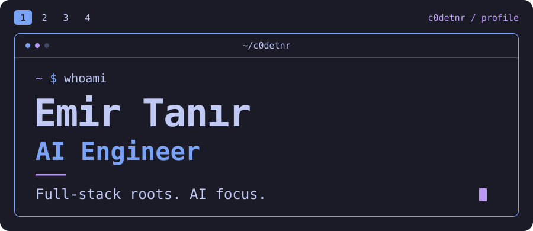

## `whoami`

**Emir Tanır · AI Engineer**

AI Engineer with a full-stack background in JavaScript and PHP. My focus has evolved toward AI technologies and professional software development. Much of my enterprise work is private and not available on GitHub.

## `stack`

| Area | Technologies & focus |
| --- | --- |
| Languages | JavaScript · TypeScript · PHP · Python |
| Database | MySQL |
| Current focus | AI applications · Automation · Enterprise software |

## `connect`

[GitHub · @c0detnr](https://github.com/c0detnr)
